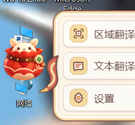
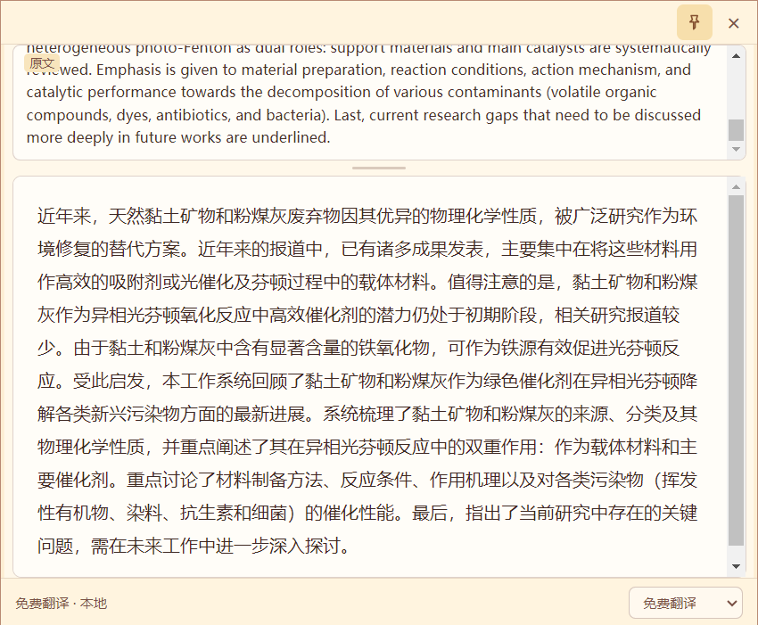
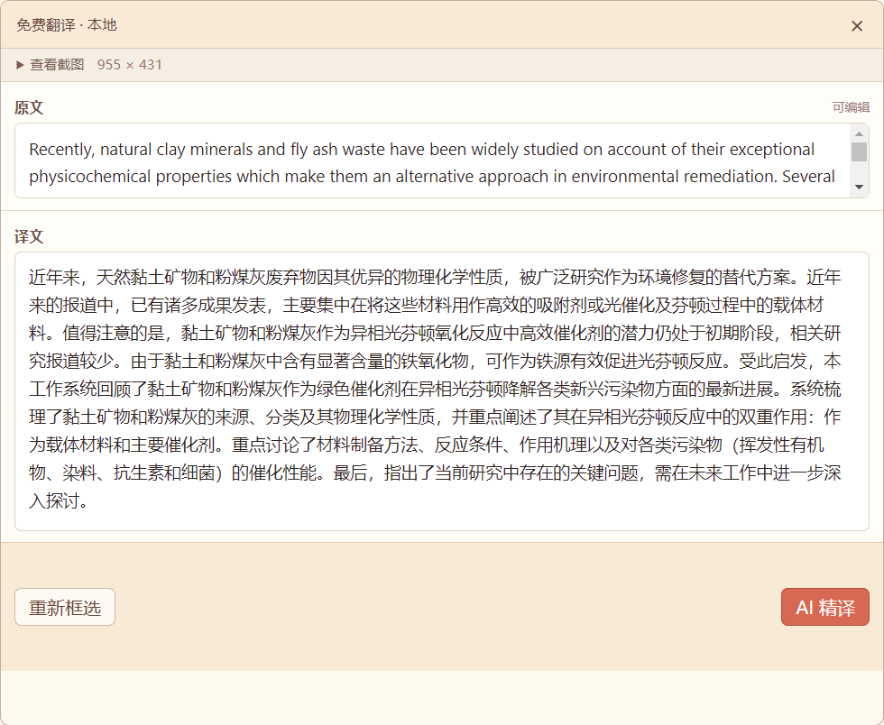
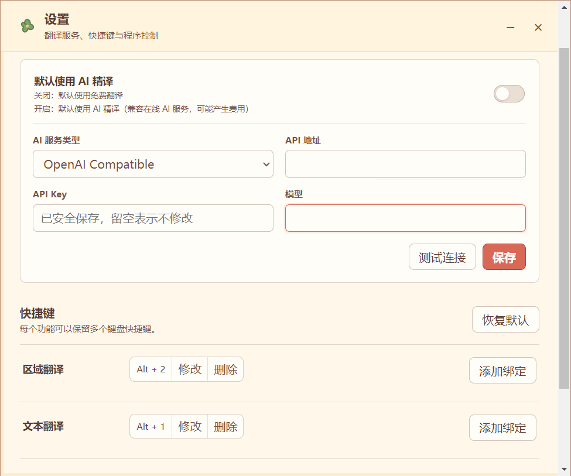

# LocalScreenTranslator

`LocalScreenTranslator` 是 GitHub 项目名称，当前应用内显示名称仍为 `Translator`。它是一款面向 Windows 的 Electron 桌面翻译工具，主要服务于科研论文阅读、技术资料查阅和日常翻译，并将本地 OCR、本地大语言模型翻译和可选的在线 AI 精译整合到轻量的悬浮球工作流中。

Translator 不是自研大语言模型。本项目使用现有开源模型和第三方组件，并在应用层实现窗口交互、翻译流程、科研表达保护、完整性检查和本地模型生命周期管理。

## 主要功能

- **文本翻译**：默认快捷键 `Alt+1`，读取剪贴板文字并直接翻译。
- **区域翻译**：默认快捷键 `Alt+2`，框选屏幕区域后执行本地 OCR 和翻译。
- **本地 OCR**：使用 Tesseract.js 识别英文、简体中文及中英文混排内容。
- **本地 Qwen 翻译**：界面中的“免费翻译”指本机运行的 Qwen3-4B-Instruct-2507 GGUF，不是在线免费 API，也不会调用在线 AI 服务。
- **AI 精译**：可配置 OpenAI-compatible API，适合需要进一步复核的内容。
- **科研翻译规则**：针对论文和技术资料使用简洁的科研翻译提示词。
- **科学表达保护**：尽量保护数字、单位、化学式、科研缩写、样品编号和引用编号。
- **完整性检查**：对可能遗漏的数字、单位、化学式、否定或比较关系给出提示，不自动篡改译文。
- **桌面悬浮球**：支持拖动、左右吸边、贴边隐藏、菜单展开及动画反馈。
- **快捷键设置**：支持在设置页修改和持久化键盘快捷键。
- **单实例运行**：重复启动时不会创建第二个 Translator 实例。
- **按需加载 Qwen**：启动 Translator 时不会立即加载本地模型，首次使用本地翻译时才启动。
- **共享 llama-server**：文本翻译和区域翻译复用同一个本地服务。
- **自动释放资源**：连续 5 分钟没有本地翻译请求时关闭 llama-server；退出 Translator 时立即清理该进程。

## 界面预览

<table>
  <tr>
    <td align="center" valign="top" width="50%">
      <br>
      <sub>悬浮球与展开菜单：快速进入区域翻译、文本翻译和设置。</sub>
    </td>
    <td align="center" valign="top" width="50%">
      <br>
      <sub>文本翻译：复制文字后直接查看本地或在线 AI 译文。</sub>
    </td>
  </tr>
  <tr>
    <td align="center" valign="top" width="50%">
      <br>
      <sub>区域翻译：框选屏幕内容后查看 OCR 原文和中文译文。</sub>
    </td>
    <td align="center" valign="top" width="50%">
      <br>
      <sub>设置页面：管理快捷键、本地翻译偏好和在线 AI 配置。</sub>
    </td>
  </tr>
</table>

## 使用方式

### 文本翻译

1. 在网页、PDF 阅读器或其他程序中复制文字。
2. 按下 `Alt+1`。
3. Translator 自动读取剪贴板并开始翻译。
4. 可在窗口中临时切换“免费翻译”或“AI 精译”。

### 区域翻译

1. 按下 `Alt+2`。
2. 拖动鼠标框选需要识别的区域。
3. 确认选区后，Translator 执行本地 OCR，并默认使用本地 Qwen 翻译。
4. 可以编辑 OCR 原文后重新翻译，也可以主动选择“AI 精译”复核当前内容。

以上是默认快捷键。用户修改快捷键并保存后，以本机设置为准。

## 技术组成

### Qwen 本地翻译

- Base model：[`Qwen/Qwen3-4B-Instruct-2507`](https://huggingface.co/Qwen/Qwen3-4B-Instruct-2507)
- 开发与测试所用 GGUF：[`unsloth/Qwen3-4B-Instruct-2507-GGUF`](https://huggingface.co/unsloth/Qwen3-4B-Instruct-2507-GGUF)
- 文件：`Qwen3-4B-Instruct-2507-Q4_K_M.gguf`

本项目没有训练、微调、LoRA、修改权重或重新量化该模型。对 Qwen 的改进位于应用层，包括科研翻译 prompt、确定性科学表达保护、完整性检查、流式输出和模型服务生命周期管理。

### llama.cpp

本地 Qwen 通过 [`ggml-org/llama.cpp`](https://github.com/ggml-org/llama.cpp) 的 `llama-server` 运行。

Translator 仓库不包含 llama.cpp 源码或二进制文件。程序从用户本机的外置目录启动 `llama-server`，等待服务就绪后通过本机 HTTP 接口请求翻译，并在空闲或退出时关闭进程。

### OCR

- OCR 引擎：Tesseract.js 7
- 英文数据：`@tesseract.js-data/eng`
- 简体中文数据：`@tesseract.js-data/chi_sim`
- 实际模型变体：`4.0.0_best_int`

首次需要 OCR 时，程序将 npm 包中的语言模型复制到 Translator 用户数据目录，再从该本地目录加载。正式运行不依赖 Tesseract OCR CDN。

## 安装与运行

LocalScreenTranslator 面向 **Windows 10/11**。当前版本主要在 Windows 10 上开发和测试，尚未声明其他操作系统支持。

运行源码需要：

- Node.js `>= 20.9.0`
- npm
- Git（使用 ZIP 下载时不需要）

### 1. 获取项目

使用 Git：

```powershell
git clone https://github.com/ciaixuenkun-source/LocalScreenTranslator.git
cd LocalScreenTranslator
```

不会使用 Git 的用户，可以在 GitHub 项目页面选择 **Code → Download ZIP**，下载后解压并在该目录打开 PowerShell。

### 2. 安装项目依赖

在项目目录运行：

```powershell
npm install
```

也可以运行：

```powershell
npm run setup
```

当前 `npm run setup` 只会在该 PowerShell 进程中设置 Electron 下载镜像，然后执行 `npm install`。它不会下载 Qwen GGUF、不会下载或安装 llama.cpp，也不会自动配置模型和 runtime 路径。

项目当前的 `.npmrc` 使用 `https://registry.npmmirror.com/`。如果该镜像在你的网络环境中不可访问，可以在当前项目目录切换为 npm 官方 registry，再安装依赖：

```powershell
npm config set registry https://registry.npmjs.org/ --location=project
npm install
```

`--location=project` 只修改当前项目配置，不会修改用户全局 npm registry。切换到官方 registry 时请直接使用 `npm install`；不要使用会临时指定 Electron 镜像的 `npm run setup`。

### 3. 准备本地 Qwen 模型

本地翻译使用 Unsloth 发布的 [`unsloth/Qwen3-4B-Instruct-2507-GGUF`](https://huggingface.co/unsloth/Qwen3-4B-Instruct-2507-GGUF)。只需从文件列表下载以下一个文件，不需要下载整个模型仓库：

```text
Qwen3-4B-Instruct-2507-Q4_K_M.gguf
```

可以直接打开该文件的 [Hugging Face 页面](https://huggingface.co/unsloth/Qwen3-4B-Instruct-2507-GGUF/blob/main/Qwen3-4B-Instruct-2507-Q4_K_M.gguf) 下载。模型文件不包含在本仓库中，请保存到项目目录之外由你自行选择的目录。

### 4. 准备 llama.cpp runtime

从 [`ggml-org/llama.cpp` Releases](https://github.com/ggml-org/llama.cpp/releases) 获取官方 Windows 预编译版本即可，不要求自行编译。请根据自己的硬件选择 CPU、Vulkan、CUDA 等合适版本。

解压后，runtime 目录中必须存在：

```text
llama-server.exe
```

不要只单独复制 `llama-server.exe`，应完整保留该发行包运行所需的配套 DLL。CUDA 版本可能还需要同一 Release 提供的配套 CUDA DLL 包，具体以对应 llama.cpp Release 的说明为准。

开发验证环境为 **llama.cpp b11146 / CUDA 12.4**。这只是当前开发和测试使用的版本，不要求所有用户必须采用完全相同的构建；但不同版本的命令行参数可能存在差异。

llama.cpp 二进制不包含在本仓库中，也不会被 Translator 设置为开机启动服务。

### 5. 配置本地路径

Translator 通过以下两个环境变量查找外置 runtime 和模型：

- `TRANSLATOR_LLAMA_RUNTIME_DIR`：包含 `llama-server.exe` 及配套 DLL 的目录。
- `TRANSLATOR_QWEN_MODEL_DIR`：包含 `Qwen3-4B-Instruct-2507-Q4_K_M.gguf` 的目录。

临时设置方法如下：

```powershell
$env:TRANSLATOR_LLAMA_RUNTIME_DIR = "<llama.cpp runtime 目录>"
$env:TRANSLATOR_QWEN_MODEL_DIR = "<Qwen GGUF 所在目录>"
npm start
```

路径可以按用户自己的磁盘布局设置，不要求使用开发者电脑上的目录。环境变量需要在启动 Electron 进程前设置。

以上 `$env:` 设置仅对当前 PowerShell 会话有效。关闭该终端后需要重新设置；如需长期使用，可在 Windows 中配置持久环境变量。

普通 Windows 用户可以这样持久设置：

1. 打开 **系统属性 → 高级 → 环境变量**。
2. 在“用户变量”区域选择“新建”。
3. 分别新建 `TRANSLATOR_LLAMA_RUNTIME_DIR` 和 `TRANSLATOR_QWEN_MODEL_DIR`。
4. 值分别填写你自己的 runtime 目录和模型目录。
5. 保存后重新打开 PowerShell，或重新启动 Translator，使新环境变量生效。

如果没有配置这两个变量，Translator 不会猜测开发者电脑路径，也不会自动切换到在线 AI。首次使用本地翻译时会提示配置环境变量。

### 6. 启动 Translator

```powershell
npm start
```

项目根目录的 `启动Translator.bat` 可作为依赖安装后的 Windows 备用启动入口。它使用当前项目目录，但不会替你配置模型或 runtime 环境变量。

创建桌面快捷方式：

```powershell
npm run shortcut:desktop
```

创建当前用户的开始菜单快捷方式：

```powershell
npm run shortcut:start-menu
```

如果通过 BAT、桌面快捷方式或开始菜单启动，请先使用 Windows 用户环境变量持久保存上述两个路径。

Translator 管理的本地 llama-server 当前监听 `127.0.0.1:18473`。如果该端口已被其他程序占用，本地模型服务可能无法启动。

### 7. 配置 AI 精译（可选）

在线 AI 完全可选。不配置在线 API 不影响本地 Qwen 翻译、本地 OCR 或区域翻译。

可配置的 OpenAI-compatible API 仅用于用户主动选择的“AI 精译”，不绑定具体服务商。以下内容可在 Translator 设置页填写：

- API Base URL
- API Key
- Model

本地 Qwen 翻译不需要在线服务 API Key。在线 AI 的 API Key 使用 Electron `safeStorage` 保存在本机，不应写入源码或提交到 GitHub。

### 8. OCR 数据

英文 `eng` 和简体中文 `chi_sim` OCR 数据已经由 npm 依赖提供。完成 `npm install` 后，用户不需要另外手工下载 OCR 模型；程序会在第一次使用 OCR 时将语言数据复制到本机用户数据目录并从本地加载。

## 安装故障排查

### `npm install` 失败

- 确认 Node.js 版本不低于 `20.9.0`，并确认 `node --version` 与 `npm --version` 可以正常执行。
- 当前项目默认使用 npmmirror。如果该镜像不可访问，按上面的 npm 官方 registry 命令切换后重新运行 `npm install`。

### Electron 下载失败

- `npm run setup` 会临时使用项目设置的 Electron 下载镜像。如果该镜像不可访问，可以尝试直接运行 `npm install`。
- Electron 二进制仍然需要可访问的下载来源；请检查当前网络或代理是否能够访问 Electron 所需的下载地址。

### 提示“本地翻译尚未配置”

- 检查是否同时设置了 `TRANSLATOR_LLAMA_RUNTIME_DIR` 和 `TRANSLATOR_QWEN_MODEL_DIR`。
- 如果刚通过 Windows 环境变量界面添加，请关闭并重新打开 PowerShell，或重启 Translator。

### 提示找不到 `llama-server.exe`

- 检查 `TRANSLATOR_LLAMA_RUNTIME_DIR` 是否直接指向包含 `llama-server.exe` 的目录。
- 确认完整解压了发行包，并保留所需配套 DLL。

### 提示找不到 Qwen GGUF

- 检查 `TRANSLATOR_QWEN_MODEL_DIR` 是否直接指向模型所在目录。
- 确认文件名为 `Qwen3-4B-Instruct-2507-Q4_K_M.gguf`，而不是其他量化版本或仍在压缩包内的文件。

### 本地模型服务无法启动

- 检查 `127.0.0.1:18473` 是否被其他程序占用。
- 检查下载的 llama.cpp 版本是否适合当前 Windows 和硬件，并确认配套 DLL 完整。

## 测试

运行正式自动测试：

```powershell
npm test
```

当前正式版本为 **70/70** 项自动测试通过。

## 已知限制

- 复杂二维表格的 OCR 阅读顺序和单元格对应关系可能不准确。
- 极小字符、上下标、引用编号和低清晰度截图可能出现 OCR 错误。
- 为避免错误修改科研内容，程序不会对可疑化学式、专业术语或 OCR 字符进行高风险猜测修正。
- Translator 面向眼前文本和屏幕区域的快速翻译，不是全文 PDF 文档解析器。
- 本地翻译质量受模型能力、截图质量和 OCR 结果影响；重要科研内容仍建议核对原文。

## 隐私说明

- Tesseract OCR 和 Qwen 本地翻译均在用户本机运行。
- 区域截图只在当前截图/OCR session 内以 Electron `nativeImage`、内存 Buffer 和 Data URL 使用。
- Translator 不会把区域截图写入磁盘翻译历史。关闭区域结果窗口、开始新的区域任务或退出 Translator 后，程序会清除相关 session 和预览数据引用，随后由 Electron/JavaScript 运行时回收内存。
- 只有用户主动使用“AI 精译”时，当前待翻译文本才会发送到用户配置的兼容在线 AI 服务，请同时遵守对应服务的隐私政策和使用条款。
- GitHub 仓库不包含 API Key、credentials、本地 Qwen 模型、llama.cpp runtime 或用户运行配置。

## 视觉素材

以下核心视觉素材由项目作者使用生成式 AI 工具，根据 Translator 项目需求生成，并经过透明背景、裁切、分层或尺寸适配：

- `translator-mascot.png`
- `translator-jump-doll.png`
- `translator-empty-bag.png`

应用图标和袋子前后层素材由这些核心素材进一步生成。它们是 Translator 的项目视觉资产，不代表任何第三方品牌或官方角色。

## 开发说明

本项目根据作者的实际科研阅读和桌面使用需求设计，并在持续的真实材料、化学、环境及技术资料测试中逐步完善。OpenAI Codex 协助完成了代码实现、调试、重构和自动测试；功能取舍、交互目标和实际验收由项目需求与使用反馈驱动。

## 第三方组件

Translator 使用或调用以下第三方项目与资源，它们不属于本项目原创成果：

- [Electron](https://github.com/electron/electron)：Windows 桌面应用运行框架
- [Tesseract.js](https://github.com/naptha/tesseract.js)：本地 OCR 引擎
- [`@tesseract.js-data/eng`](https://www.npmjs.com/package/@tesseract.js-data/eng)：英文 OCR 语言数据
- [`@tesseract.js-data/chi_sim`](https://www.npmjs.com/package/@tesseract.js-data/chi_sim)：简体中文 OCR 语言数据
- [Sharp](https://github.com/lovell/sharp)：OCR 图像预处理
- [Qwen3-4B-Instruct-2507](https://huggingface.co/Qwen/Qwen3-4B-Instruct-2507)：本地翻译所用基础模型
- [Unsloth Qwen3 GGUF](https://huggingface.co/unsloth/Qwen3-4B-Instruct-2507-GGUF)：开发与测试所用 GGUF 发布版本
- [llama.cpp](https://github.com/ggml-org/llama.cpp)：本地 GGUF 推理服务

## 许可证

Translator 自身有权许可的代码和素材采用 [MIT License](LICENSE)。第三方组件、模型和数据仍遵循各自的上游许可证。详细信息见 [THIRD_PARTY_NOTICES.md](THIRD_PARTY_NOTICES.md)。

## 当前状态

Translator 当前已进入可日常使用阶段，重点覆盖科研论文、技术资料、网页、说明书和无法直接复制文字的 PDF。后续维护以实际使用中发现的问题为主，不承诺对复杂文档布局或所有 OCR 场景提供完全准确的解析。
